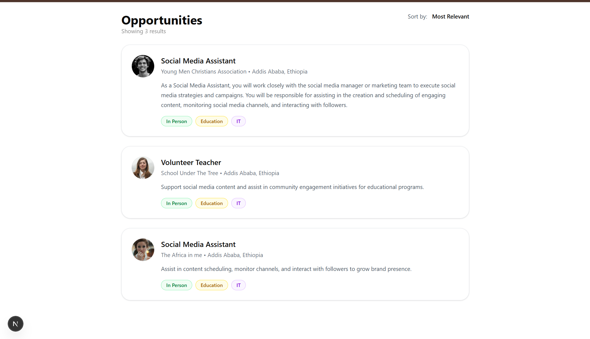
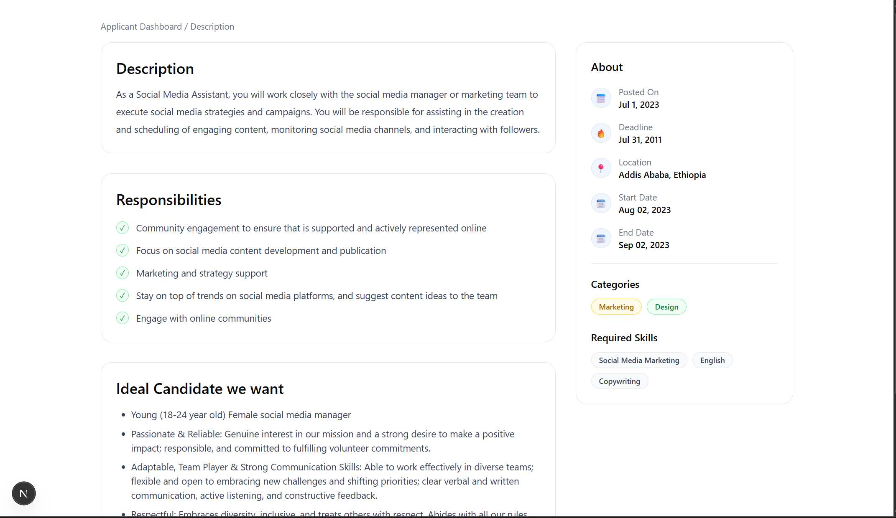
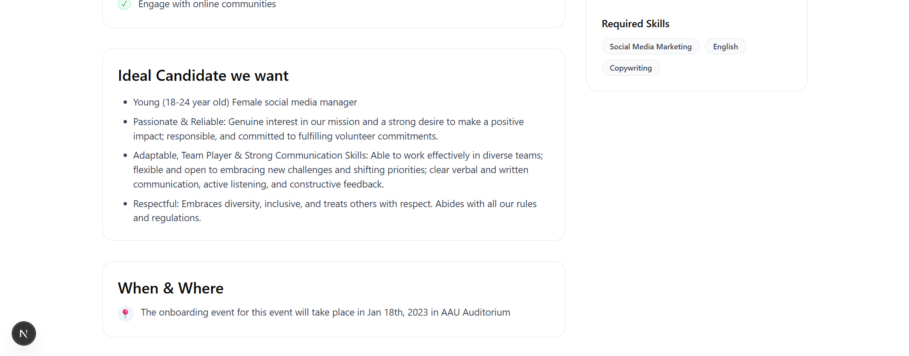

## Job Listing Application (Task 6)

A small job listing app built with Next.js App Router and Tailwind CSS. It implements a Job Card component, an Opportunities page that lists jobs from JSON, and an Applicant Dashboard/Description page.

## Getting Started

Run the dev server:

```bash
npm run dev
# or: yarn dev / pnpm dev / bun dev
```

Then open http://localhost:3000

## App Structure

- `app/(root)/opportunities/page.tsx` — Opportunities list (fetches `/jobs.json`).
- `app/(dashboard)/dashboard/page.tsx` — Applicant Dashboard/Description (fetches `/jobs.json`).
- `components/JobCard.tsx` — Reusable job card with avatar + tag pills.
- `public/jobs.json` — Data source mirrored from the provided Google Doc.
- `middleware.ts` — Redirects `/` to `/opportunities`.

## Data Source

The app reads jobs from a local JSON file: `public/jobs.json`.
This mirrors fields from the shared document and avoids CORS issues.

Shape:

```json
{
  "job_postings": [
    {
      "title": "...",
      "organization": "...",
      "location": "...",
      "description": "...",
      "tags": ["In Person", "Education", "IT"],
      "avatarUrl": "https://...",
      "postedOn": "...",
      "deadline": "...",
      "startDate": "...",
      "endDate": "...",
      "categories": ["..."],
      "skills": ["..."],
      "responsibilities": ["..."],
      "idealCandidate": ["..."],
      "whenWhere": "..."
    }
  ]
}
```






- Opportunities page — `app/(root)/opportunities/page.tsx`
  - Description: List of job cards populated from JSON with avatar and tags.
- Applicant Dashboard — `app/(dashboard)/dashboard/page.tsx`
  - Description: Data-driven description, responsibilities, ideal candidate, when & where, and sidebar (about, categories, skills).

Place your images in `README-assets/` and reference them below:

```


```

## Notes

- Styling is implemented with Tailwind CSS (v4). Tags are color-coded to match the UI reference.
- `JobCard` accepts an optional `href` to make the whole card clickable (navigates to the dashboard in this demo).
- To use a remote JSON instead of `public/jobs.json`, replace the `fetch` URLs accordingly and ensure CORS allows the request.
